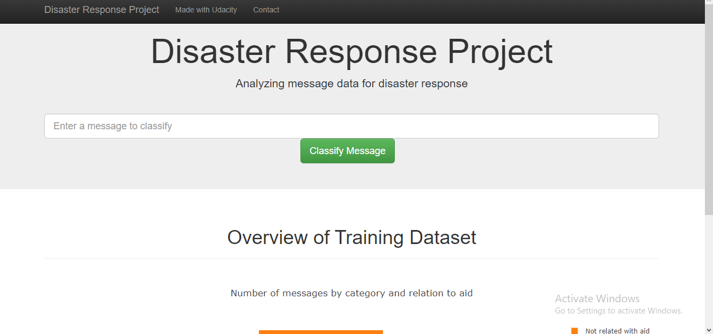
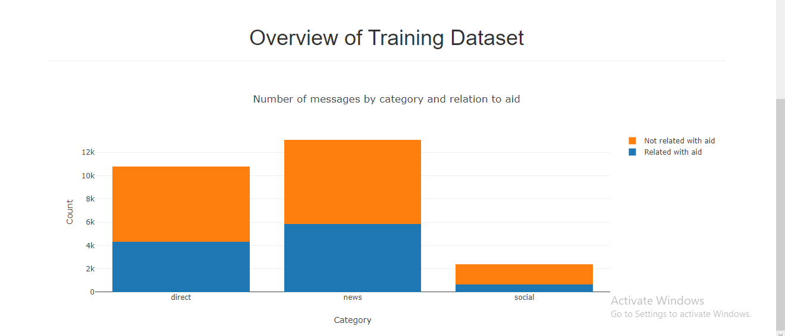
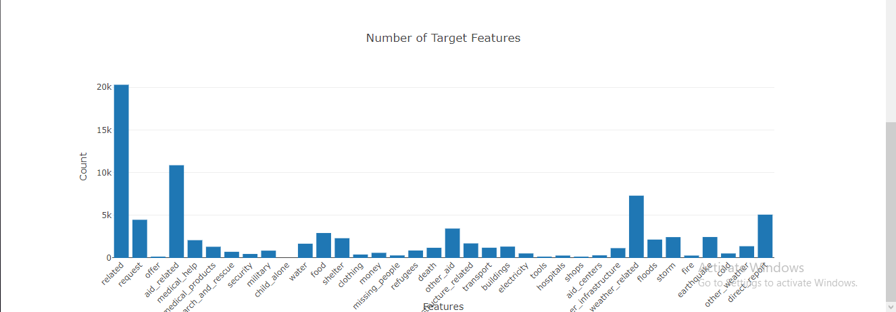

# Disaster Response Pipeline

## 1. Project Introduction

In this project,using data provided by [Figure-Eight](https://www.figure-eight.com/) I built a model classifying disaster messages.

I used a data set which are real messages sent during various disasters. In order to categorize these disaster messages i built a machine learning pipeline as well as a web application were you can type a new message and get itsa classification results ( Visualization will also be provided in the web app).

## 2. Project Units

> ### 1. ETL Pipeline

The etl.py file contains data a cleaning pipeline in python that:

* Loads the files messages.csv and categories.csv which contains the messages and the categories of them
* Merges the two datasets 
* Cleans them
* Stores the merged dataset in an SQLite database (DisasterResponse.db)

> ### 2. ML Pipeline

the ml.py file contains machine learning pipeline in python that:

* Loads data from the database saved by the etl pipeline
* Splits the data into training and testing sets
* Builds a text processing and machine learning pipeline
* Trains a model using GridSearchCV
* Outputs result on the test set
* Exports the model as a pickle file (classifier.pkl)

> ### 3. Flask Web App

The web app where users can enter their query

## 3. How to run the project

Three steps to start the web app starting the from ETL process.

> ### 1. Cleaning

Go to the project directory and the type in:  
python (the file path to the **etl.py**) (the file path to the **messages.csv**) (the file path to the **categories.csv**) (the file path to the **database file** you want to save the database output(DisasterResponse.db)

> ### 2. Training 

Go to the project directory and the type in:  
python (the file path to the **ml.py**) (the file path to the **database file** saved after the etl) (the file path to the **pickle file** you want to save the model output(classifier.pkl)

> ### 3. Web app

Go to the app directory and type in:  
**run.py  **
And visit the link:  
**https://0.0.0.0:3001**

## 4. Conclusion

Some information about training data set as seen on the main page of the web app.

As we can see the data is highly imbalanced. Though the accuracy metric is [high](#acc) (you will see the exact value after the model is trained by grid search, it is ~0.94), it has a poor value for recall (~0.6). So, take appropriate measures when using this model for decision-making process at a larger scale or in a production environment.

## 5. Files
> #### App

     1.run.py = file that runs the app 
     2.templates = go.html and master.html
> #### Data

     1. etl.py = the ETL process  
     2. DisasterResponse.db = Database with cleaned data 
     3. categories.csv = categories 
     4. messages.csv = messages
> #### Screenshots 
      
     Screenshots of the webapp

> #### Models

     1. ml.py = the machine learning pipeline
     2. classifier.pkl = the pickle file containing the model

## 6. Libraries

   1. pandas  
   2. nltk  
   3. numpy  
   4. Flask  
   5. plotly  
   6. scikit-learn  
   7. SQLAlchemy

## 7. Acknowledgements

   1.[Udacity](https://udacity.com)  
   2.[Figure-Eight](https://figure-eight.com)  
   3.[Stack Overflow](https://https://stackoverflow.com)
